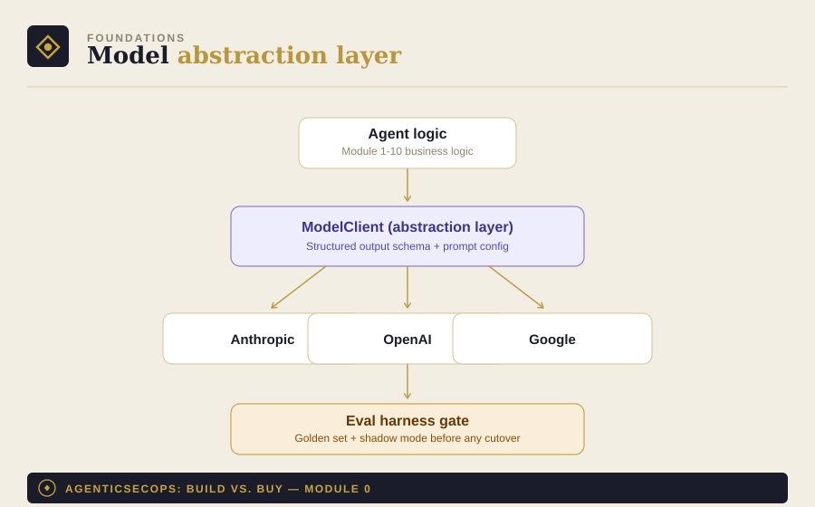

# Module 0: Foundations

Part of [AgenticSecOps: Build vs. Buy](../README.md). Read
[DISCLAIMER.md](../DISCLAIMER.md) before running anything here.

> **Code status: unvalidated.** The code in this module illustrates the
> architecture and approach — it has not been tested end-to-end in a
> production environment. Adapt, test, and review it yourself before
> running it against anything that matters. Use is entirely at your own
> discretion and risk.

Every module in this series shares three things in common, and instead
of repeating them ten times, they live here once.

## 1. Why a foundations module

If you build all 10 modules the way most tutorials teach — import a
provider's SDK directly, hardcode a model name, embed prompts in
application code — you end up with 10 pieces of tooling welded to one
LLM vendor. When a stronger model ships next quarter (and it will), that
becomes 10 rewrites instead of 10 config changes.

The pattern below is the thing to build once, then reuse across every
module that follows.

## 2. The model-abstraction pattern

Four pieces, in order of how much they save you later:

**a. A provider-agnostic call layer.** Route every LLM call through a
thin wrapper instead of importing a provider's SDK directly into agent
logic. See [`model_client.py`](./model_client.py) — swapping models
becomes a config value, not a code change.

**b. Structured output contracts, enforced by schema — not by trusting
model behavior.** Every agent output (a finding, a verdict, a ranked
list) validates against a fixed schema regardless of which model
produced it. This is what lets downstream consumers (a dashboard, a
ticketing integration, a report generator) keep working across a model
swap.

**c. Prompts as versioned config, not embedded strings.** Prompts live
in their own files, not inline in application code, so changing one is
a content edit, not a deploy.

**d. A golden eval set per module.** Before you can responsibly swap a
model, you need a labeled dataset — known-good/known-bad findings,
labeled historical alerts, known vulnerabilities with expected
classifications — that you rerun on every swap. See
[`eval_harness.py`](./eval_harness.py) for a minimal runner. Without
this, "easy to switch" quietly becomes "switched, and regressed your
false-negative rate for three weeks before anyone noticed."

**Before cutting over a new model in any module touching production
(especially modules 9 and 10), run it in shadow mode** — parallel to the
incumbent, against live input, diffing verdicts — for a defined period.
Only cut over once the eval set and shadow-mode comparison both clear.

## 3. Which model for which task (the durable version)

Specific model names go stale within a couple of quarters. The
underlying pattern is more durable:

- **Reasoning-heavy, multi-hop tasks** (tracing a permission grant
  through config layers, authorization-logic analysis, architectural
  code review) → favor whichever provider's current model leads on
  deep, long-horizon reasoning benchmarks.
- **Browser/computer-use tasks** (DAST scanning, anything driving a
  browser or operating tools interactively) → favor whichever model
  leads on agentic tool-use/computer-use benchmarks.
- **Long-context, multimodal evidence review** (compliance PDFs,
  architecture diagrams, large log dumps) → favor whichever model has
  the largest reliable context window for your volume.

Check current benchmarks before each module, don't assume last
quarter's ranking holds.

## 4. The authorization baseline

This applies to every module, but matters most for anything resembling
scanning, testing, or simulated attack behavior (modules 2, 3, 4, 5, 8,
9, 10):

**Only run this against systems you own or have explicit, written
authorization to test.** Unauthorized access to a computer system is
illegal in most jurisdictions, including under the U.S. Computer Fraud
and Abuse Act, regardless of intent. See
[DISCLAIMER.md](../DISCLAIMER.md) for the full terms — every module
inherits this baseline rather than restating it.

## 5. What's in this module

- [`model_client.py`](./model_client.py) — the provider-agnostic call
  layer with structured output validation
- [`eval_harness.py`](./eval_harness.py) — a minimal golden-eval runner
  to validate a model swap before cutover
- [`prompts/`](./prompts) — example of prompts-as-config, referenced by
  the client rather than embedded in it

Every module from here (1 through 10) imports this pattern rather than
reinventing it.
