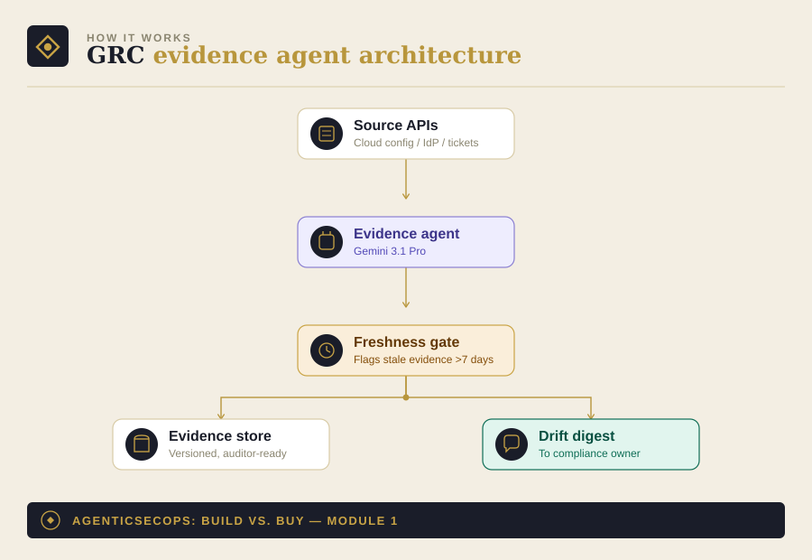

# Module 1: GRC / Compliance Evidence-Collection Agent

Part of [AgenticSecOps: Build vs. Buy](../README.md). Read
[DISCLAIMER.md](../DISCLAIMER.md) before running anything here. Built
on the pattern in [Module 0](../00-foundations).

> **Code status: unvalidated.** The code in this module illustrates the
> architecture and approach — it has not been tested end-to-end against
> a live cloud/compliance environment. Adapt, test, and review it
> yourself before running it against anything that matters. Use is
> entirely at your own discretion and risk.

## 1. The problem

SOC 2, HIPAA, and ISO audits run on evidence: screenshots, config
exports, access logs, policy documents — proof that a control is
actually in effect, not just written down. Collected by hand, this is
a person screenshotting dashboards once a quarter, and it goes stale
the moment anything changes in between.

**Consequence if missed:** stale or missing evidence at audit time.
Liberal case — audit delay, $10K–20K in re-audit and consulting cost.
Worst case — a failed audit costs you the enterprise deal that required
it in the first place, often $100K–$1M+ in ARR, plus reputational
damage with every future prospect who asks "are you SOC 2 compliant?"

## 2. Architecture



- **Source APIs**: your cloud provider's config/IAM APIs, your IdP, your
  ticketing system — wherever the actual control state lives
- **Evidence agent**: pulls current state, compares against what the
  control requires, and drafts the plain-English narrative an auditor
  reads alongside the raw evidence
- **Freshness gate**: every piece of evidence has an age; anything
  stale past a threshold gets flagged before it silently becomes a
  problem at audit time
- **Output**: an evidence store (versioned, so you can show an auditor
  the state at any point in time) plus a drift digest when something
  no longer matches its control

## 3. Build walkthrough

### Prerequisites
- Read-only credentials to whatever systems hold your control evidence
  (cloud config API, IdP admin API, etc.)
- An LLM API key — see [Module 0](../00-foundations) for the
  provider-agnostic client this wraps

### The collector + narrative agent

```python
# evidence_agent.py
import json
import os
from datetime import datetime, timezone

from model_client import ModelClient, load_prompt  # from Module 0
from pydantic import BaseModel


class ControlEvidence(BaseModel):
    control_id: str
    status: str  # "met" | "not_met" | "needs_review"
    narrative: str
    raw_evidence_ref: str
    checked_at: str


TRIAGE_SYSTEM_PROMPT = """You are a compliance evidence assistant. You
will be given the raw current-state output for one control (e.g. "is
MFA enforced org-wide", "are access reviews happening quarterly").

Compare the raw state against the control's requirement and respond
with:
- status: "met", "not_met", or "needs_review" (use needs_review if the
  raw data is ambiguous — do not guess)
- narrative: a 2-3 sentence plain-English explanation an auditor could
  read alongside the raw evidence

Respond in JSON only, matching: {control_id, status, narrative}.
"""


def check_control(client: ModelClient, control_id: str, raw_state: dict) -> ControlEvidence:
    result = client.call_structured(
        system=TRIAGE_SYSTEM_PROMPT,
        user_content=json.dumps({"control_id": control_id, "raw_state": raw_state}),
        schema=ControlEvidence,
    )
    result.checked_at = datetime.now(timezone.utc).isoformat()
    return result


def freshness_check(evidence_store_path: str, max_age_days: int = 7) -> list[str]:
    """Returns control_ids whose evidence hasn't refreshed within
    max_age_days. Run this on a schedule — a silently broken collector
    is invisible until audit day otherwise."""
    stale = []
    with open(evidence_store_path) as f:
        for line in f:
            record = json.loads(line)
            checked_at = datetime.fromisoformat(record["checked_at"])
            age_days = (datetime.now(timezone.utc) - checked_at).days
            if age_days > max_age_days:
                stale.append(record["control_id"])
    return stale


def main():
    client = ModelClient(provider="google", model="gemini-3.1-pro")

    # Replace with real pulls from your cloud/IdP APIs — this is where
    # you adapt the module to your actual control set.
    controls_to_check = {
        "MFA-ORG-WIDE": {"mfa_enforced_pct": 100, "exceptions": []},
        "ACCESS-REVIEW-QUARTERLY": {"last_review_date": "2026-05-01"},
    }

    evidence = []
    for control_id, raw_state in controls_to_check.items():
        result = check_control(client, control_id, raw_state)
        evidence.append(result.model_dump())
        print(f"{control_id}: {result.status}")

    with open("./evidence_store.jsonl", "a") as f:
        for record in evidence:
            f.write(json.dumps(record) + "\n")

    stale = freshness_check("./evidence_store.jsonl")
    if stale:
        print(f"⚠️  Stale evidence (>7 days) for: {stale}")


if __name__ == "__main__":
    main()
```

## 4. Boundaries

| Zone | What the agent does |
|---|---|
| **Autonomous** | Pull raw state, draft the narrative, run the freshness check |
| **Human-gate** | Final sign-off on the compliance narrative before it goes to an auditor — the agent drafts, a human who understands the actual control intent approves |
| **Vendor-territory** | If you're maintaining evidence for more than 2-3 frameworks simultaneously across multiple auditors, the coordination overhead likely exceeds what this module alone solves — that's what dedicated GRC platforms are actually pricing in |

## 5. Eval / KPI checklist

- **Evidence freshness %** — what fraction of controls have evidence
  under the staleness threshold at any given time
- **Narrative accuracy** — sample-audit agent-drafted narratives against
  what a human reviewer would have written
- **Time-to-export** — how long it takes to produce a full evidence
  package when an auditor asks, cold

## 6. Cost model

- **Build**: ~1 engineer, 6–8 weeks (~$15K–$25K in eng time)
- **Run**: infrequent calls (evidence doesn't need re-checking hourly) —
  low tens of dollars per month in inference at typical control-set size
- **Vendor equivalent**: Vanta/Drata style platforms, roughly $20K–$25K/year median, plus separate audit fees ($8K–$16K for a small-mid SOC 2 Type II)
- **Ongoing**: ~0.1–0.2 FTE to keep integrations current as APIs change

## 7. Model recommendation

Gemini-class models for this one specifically — compliance evidence
review is fundamentally a long-context, often-multimodal task (PDFs,
policy documents, architecture diagrams alongside raw config dumps),
which is where a large reliable context window earns its keep more than
raw reasoning depth. See [Module 0](../00-foundations) for the general
selection framework.

## 8. Build vs. buy verdict

**Buy**, for most early and mature startups. Speed to your first SOC 2
report is usually what's actually gating an enterprise deal, and the
vendor platforms have already solved the auditor-relationship and
framework-mapping problem you'd otherwise be recreating. The cost
asymmetry doesn't favor DIY here the way it does for CSPM.

**Build**, once you're maintaining evidence across multiple frameworks
long-term and already have a security/platform engineering team who can
own the 0.2 FTE — at that point the recurring vendor cost starts to
look like the more expensive option, and you have the team to absorb
the maintenance.
