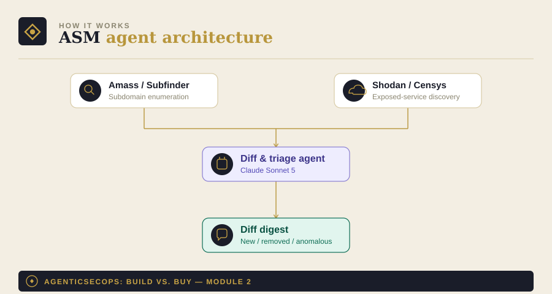

# Module 2: Attack Surface Management (ASM) Agent

Part of [AgenticSecOps: Build vs. Buy](../README.md). Read
[DISCLAIMER.md](../DISCLAIMER.md) before running anything here. Built
on the pattern in [Module 0](../00-foundations).

> **Code status: unvalidated.** The code in this module illustrates the
> architecture and approach — it has not been tested end-to-end against
> a live environment. Adapt, test, and review it yourself before
> running it against anything that matters. Use is entirely at your own
> discretion and risk.

## 1. The problem

You can't secure what you don't know you have. A forgotten subdomain, a
dev environment that never got decommissioned, a cloud storage bucket
someone spun up for a demo — these accumulate silently, and the first
time most companies learn about one is when someone else finds it
first.

**Consequence if missed:** an unknown exposed asset becomes an
attacker's entry point. Liberal case — caught reasonably fast,
contained, $10K–50K incident response. Worst case — full breach through
that entry point, $3.31M SMB average, up to $5.13M if ransomware
follows.

## 2. Architecture



- **Recon layer**: OSS tools that do the actual enumeration —
  [Amass](https://github.com/owasp-amass/amass) and
  [Subfinder](https://github.com/projectdiscovery/subfinder) for
  subdomain discovery, [Shodan](https://www.shodan.io)/[Censys](https://censys.io)
  APIs for exposed-service discovery. The agent doesn't reinvent this.
- **Diff agent**: compares today's scan against the last known
  inventory and classifies what changed — new asset, removed asset, or
  changed exposure on an existing one
- **Output**: a diff report (what's new/changed/removed) plus a
  monthly posture summary

This is one of the safest modules to run fully autonomously — it's
read-only enumeration against public/semi-public data sources, not
anything that touches your own infrastructure.

## 3. Build walkthrough

### Prerequisites
- `amass` and `subfinder` installed (`brew install amass subfinder` or
  see their install docs)
- A Shodan or Censys API key (both have free tiers sufficient to start)

### Step 1 — Run recon

```bash
subfinder -d yourcompany.com -o ./scans/subdomains.txt
amass enum -passive -d yourcompany.com -o ./scans/amass_output.txt
```

### Step 2 — Diff and triage agent

```python
# asm_agent.py
import json
import os
from datetime import datetime, timezone

from model_client import ModelClient, load_prompt  # from Module 0
from pydantic import BaseModel


class AssetClassification(BaseModel):
    asset: str
    classification: str  # "known" | "new_needs_review" | "anomaly"
    reasoning: str


DIFF_SYSTEM_PROMPT = """You are an attack-surface triage assistant.
You'll be given a list of newly discovered assets (subdomains, exposed
services) that weren't in the previous scan. For each, classify it:

- "known": clearly part of expected infrastructure (e.g. a standard
  naming pattern matching known services)
- "new_needs_review": plausible but not obviously expected — needs a
  human to confirm it's intentional
- "anomaly": unusual enough to flag with higher urgency (e.g. an
  exposed admin panel, a service on an unexpected port, a naming
  pattern suggesting a forgotten dev/test environment)

Respond in JSON only, one object per asset: {asset, classification,
reasoning}.
"""


def load_current_scan(subfinder_path: str, amass_path: str) -> set[str]:
    assets = set()
    for path in [subfinder_path, amass_path]:
        if os.path.exists(path):
            with open(path) as f:
                assets.update(line.strip() for line in f if line.strip())
    return assets


def load_previous_inventory(path: str) -> set[str]:
    if not os.path.exists(path):
        return set()
    with open(path) as f:
        return set(json.load(f).get("assets", []))


def diff_and_triage(client: ModelClient, new_assets: list[str]) -> list[AssetClassification]:
    if not new_assets:
        return []
    result = client.call_structured(
        system=DIFF_SYSTEM_PROMPT,
        user_content=json.dumps({"new_assets": new_assets}),
        schema=list[AssetClassification],  # adapt per your ModelClient's list-handling
    )
    return result


def main():
    client = ModelClient(provider="anthropic", model="claude-sonnet-5")

    current = load_current_scan("./scans/subdomains.txt", "./scans/amass_output.txt")
    previous = load_previous_inventory("./inventory.json")

    new_assets = current - previous
    removed_assets = previous - current

    print(f"{len(new_assets)} new assets, {len(removed_assets)} removed assets")

    triaged = diff_and_triage(client, list(new_assets))
    anomalies = [t for t in triaged if t.classification == "anomaly"]

    if anomalies:
        print(f"⚠️  {len(anomalies)} anomalies flagged for immediate review")
        for a in anomalies:
            print(f"  - {a.asset}: {a.reasoning}")

    with open("./inventory.json", "w") as f:
        json.dump({
            "assets": list(current),
            "last_scan": datetime.now(timezone.utc).isoformat(),
        }, f, indent=2)


if __name__ == "__main__":
    main()
```

## 4. Boundaries

| Zone | What the agent does |
|---|---|
| **Autonomous** | Full discovery, diffing, and classification — read-only, low blast radius even fully unattended |
| **Human-gate** | Reviewing `new_needs_review` and `anomaly` classifications before deciding on action — the agent flags, it doesn't remediate |
| **Vendor-territory** | Rarely applies here regardless of company size — this stays a reasonable DIY module even at scale |

## 5. Eval / KPI checklist

- **Time-to-detect** a new exposed asset from when it actually went live
- **False-positive rate** on `anomaly` classifications (sample-audit
  weekly early on, monthly once stable)
- **Coverage completeness** — cross-check annually against an
  independent paid audit or a different tool, since the risk of a
  missed asset is a blind spot, not something self-correcting

## 6. Cost model

- **Build**: ~1 engineer, 2–4 weeks (~$8K–$15K in eng time)
- **Run**: Shodan/Censys API subscriptions, roughly $60–$350/month
  depending on scan frequency and coverage; LLM inference cost is low
  since this only processes the delta, not the full asset list, each run
- **Vendor equivalent**: standalone ASM tools or bundled into an MSSP
  retainer, roughly $1K–$3K/month
- **Ongoing**: ~0.1 FTE — this is closer to "set it up and glance at
  the digest" than an ongoing maintenance burden

## 7. Model recommendation

Claude and GPT-class models are roughly interchangeable here — the
task is mostly orchestration and classification of a bounded list, not
deep multi-hop reasoning. Pick based on whichever you're already using
elsewhere via the [Module 0](../00-foundations) abstraction layer;
this module isn't where model choice moves the needle.

## 8. Build vs. buy verdict

**Build**, almost regardless of company stage. This is one of the
cheapest and lowest-risk modules in the series — pure read-only
enumeration, no write access to anything, and the OSS tooling already
does the hard part. Even a pre-seed company with minimal infrastructure
benefits from knowing what's actually externally visible.

**Buy**, only if you'd rather have this bundled into a broader MSSP
retainer you're already paying for anyway, or if your attack surface is
large/complex enough (multi-cloud, many subsidiaries, M&A-driven sprawl)
that commercial ASM tooling's more mature deduplication and asset
fingerprinting genuinely outperforms a DIY diff script.
