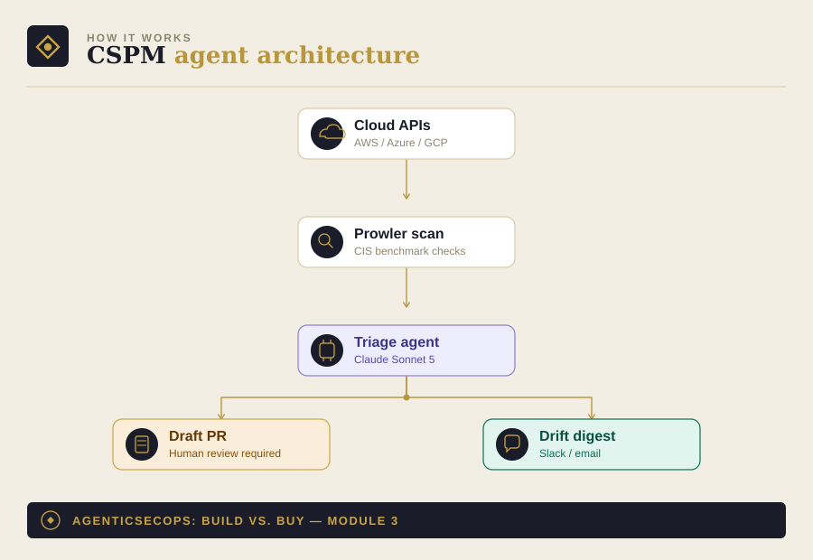

# Module 3: CSPM Agent — Continuous Cloud Config Drift Detection

Part of [AgenticSecOps: Build vs. Buy](../README.md). Read
[DISCLAIMER.md](../DISCLAIMER.md) before running anything here.

> **Code status: unvalidated.** The code in this module illustrates the
> architecture and approach — it has not been tested end-to-end against
> a live cloud environment. Adapt, test, and review it yourself before
> running it against anything that matters. Use is entirely at your own
> discretion and risk.

## 1. The problem

Cloud misconfiguration — a storage bucket that quietly flips to public, a
security group opened to 0.0.0.0/0, an IAM role with wildcard permissions
— is one of the most common real-world breach entry points, and it's
almost never caught by a human reviewing the console. It's caught (or
missed) by whether something is continuously checking config state
against a known-good baseline.

**Consequence if missed:** a misconfig that ships and gets found by an
attacker instead of by you. Liberal case — caught fast, minimal exposure,
low four figures to remediate. Worst case — a real breach: <cite>average
breach cost $4.44M, of which ~$1.47M is just detection and escalation,</cite>
plus notification costs and regulatory exposure if the exposed data is
regulated.

## 2. Architecture



- **Scanner layer**: [Prowler](https://github.com/prowler-cloud/prowler)
  (OSS, does the actual CIS-benchmark checks — the agent does not
  reinvent this)
- **Agent layer**: an LLM call that takes Prowler's raw JSON output,
  triages by severity + blast radius, groups related findings, and
  drafts human-readable remediation guidance
- **Output**: a daily drift digest to your team channel, and — for
  high-confidence, low-risk findings only — a draft PR with the fix.
  **The agent never applies the fix directly.** See boundaries below.

## 3. Build walkthrough

### Prerequisites
- Prowler installed and configured with read-only cloud credentials
  (`pip install prowler`)
- An Anthropic API key
- (Optional) a GitHub token if you want the agent to open draft PRs

### Step 1 — Run the scan

```bash
prowler aws --output-formats json-asff --output-directory ./scans
```

This produces a JSON file of findings. You do not need to write a
scanner — Prowler already implements the CIS AWS Foundations Benchmark
and dozens of other checks. The agent's job starts after this.

### Step 2 — Triage agent

Run [`agent.py`](./agent.py) against the scan output. It sends the raw
findings to Claude with a system prompt that groups related findings by
root cause and classifies each group as safe-to-auto-draft or
needs-human-review (the exact criteria are in the prompt, worth reading
before you run it against your own environment — the bar for
"auto-draftable" is intentionally conservative).

```bash
python agent.py
# → writes triage_output.json
```

### Step 3 — Draft the fix (separate, explicit step)

Run [`draft_pr.py`](./draft_pr.py) — deliberately a **separate script**
from `agent.py`. Triaging findings and opening PRs are two different
decisions; this repo doesn't chain them into one automatic pipeline.
Every PR it opens is marked `draft: true` and requires manual review.

```bash
python draft_pr.py
```

## 4. Boundaries

| Zone | What the agent does |
|---|---|
| **Autonomous** | Run scans, triage, group findings, write plain-English summaries |
| **Human-gate** | Every draft PR is marked `draft: true` and requires manual merge — no exceptions, regardless of "auto_draftable" confidence |
| **Vendor-territory** | If your finding volume exceeds what one engineer can review PRs for weekly, or you lack a staging environment to test remediations before prod, that's your signal to buy rather than keep scaling this manually |

## 5. Eval / KPI checklist

Track these from week one:
- **False-positive rate** on `auto_draftable` classification (sample-audit weekly)
- **Mean time from finding to merged fix**
- **Drift recurrence rate** — same misconfig reappearing signals a process gap, not just a tooling one
- **Posture score trend** (% of CIS benchmark checks passing, tracked monthly)

## 6. Cost model

- **Build**: ~1 engineer, 3–5 weeks (~$12K–$20K in eng time)
- **Run**: Prowler is free/OSS; LLM inference cost scales with scan frequency and account size — for a daily scan on a small-to-mid AWS account, typically low hundreds of dollars per month at current API rates, not thousands
- **Vendor equivalent**: CSPM bundled into CNAPP/XDR suites, roughly $2K–$8K/month standalone
- **Ongoing**: ~0.15–0.2 FTE (a cloud/platform engineer keeping the ruleset and integrations current)

## 7. Model recommendation

Claude Sonnet 5 — this task is fundamentally multi-hop config reasoning
(tracing whether a permission grant is actually reachable given a
resource's other settings), which is where Claude's architecture-tracing
strength matters more than raw speed or cost. See the model-selection
rationale in [Module 0](../00-foundations) for the general framework.

## 8. Build vs. buy verdict

**Build**, if: you have a real (not trivial) cloud footprint, at least
one engineer who can own this part-time on an ongoing basis, and — this
is the part people skip — a staging environment to test remediations
before they touch anything auto-drafted. This is one of the more
defensible DIY modules in the series: low blast radius if the agent gets
a classification wrong (worst case is a missed finding, not an outage,
as long as you hold the human-gate on merges).

**Buy**, if: you don't have a dedicated engineer to own the 0.2 FTE of
ongoing maintenance, or you're pre-Series-A and don't yet have a cloud
footprint complex enough to generate meaningful drift. At that stage the
$2K–8K/month vendor cost is arguably not worth it either way — you may
simply not need this module yet.
