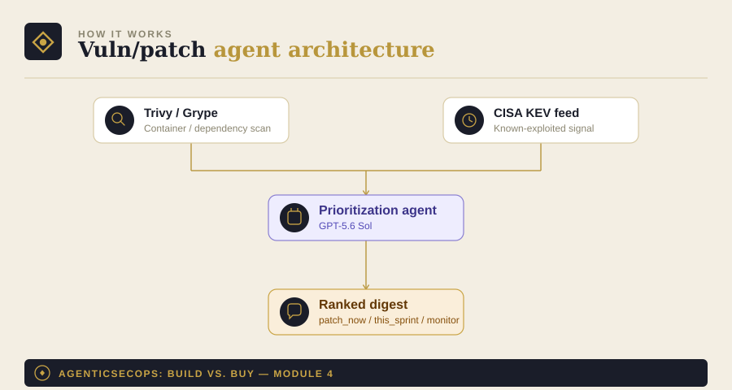

# Module 4: Vulnerability Prioritization & Patch Agent

Part of [AgenticSecOps: Build vs. Buy](../README.md). Read
[DISCLAIMER.md](../DISCLAIMER.md) before running anything here. Built
on the pattern in [Module 0](../00-foundations).

> **Code status: unvalidated.** The code in this module illustrates the
> architecture and approach — it has not been tested end-to-end against
> a live environment. Adapt, test, and review it yourself before
> running it against anything that matters. Use is entirely at your own
> discretion and risk.

## 1. The problem

Every scanner produces a firehose of CVEs — most of them low-risk,
theoretical, or already mitigated by something else in your stack. The
handful that actually matter (known-exploited, reachable, on a
critical asset) get lost in the noise, and that's usually the one that
gets weaponized before anyone patches it.

**Consequence if missed:** a known-exploited CVE stays unpatched long
enough to get used. Liberal case — caught and cleaned up before real
damage, $10K–50K contained response. Worst case — a full ransomware
event: average ransom payment ~$2M, downtime at ~$53K/hour (two days
≈ $2.5M), plus $120K–$1.6M in recovery costs.

## 2. Architecture



- **Scanners**: [Trivy](https://github.com/aquasecurity/trivy) or
  [Grype](https://github.com/anchore/grype) for container/dependency
  scanning — free, OSS, doing the actual detection work
- **CISA KEV feed**: the [Known Exploited Vulnerabilities
  catalog](https://www.cisa.gov/known-exploited-vulnerabilities-catalog) —
  free, updated continuously, the single best signal for "this isn't
  theoretical, it's actively being used"
- **Prioritization agent**: cross-references scan findings against KEV
  status and asset criticality, ranks what actually needs attention
  this week vs. what can wait
- **Output**: a ranked digest to eng leads, plus draft patch PRs for
  low-risk, high-confidence fixes only

## 3. Build walkthrough

### Prerequisites
- `trivy` or `grype` installed and able to scan your images/dependencies
- No API key needed for the CISA KEV feed — it's a public JSON file
- An LLM API key — this module uses [Module 0](../00-foundations)'s
  provider-agnostic client

### The prioritization agent

```python
# patch_agent.py
import json
import subprocess
import urllib.request
from datetime import datetime, timezone

from model_client import ModelClient  # from Module 0
from pydantic import BaseModel

KEV_FEED_URL = "https://www.cisa.gov/sites/default/files/feeds/known_exploited_vulnerabilities.json"


class PatchPriority(BaseModel):
    cve_id: str
    priority: str  # "patch_now" | "patch_this_sprint" | "monitor"
    reasoning: str
    known_exploited: bool


PRIORITIZE_SYSTEM_PROMPT = """You are a vulnerability prioritization
assistant. You'll be given scan findings (CVE IDs, affected packages,
CVSS scores) plus a list of which CVEs are in CISA's Known Exploited
Vulnerabilities catalog, and asset criticality context.

For each finding, assign priority:
- "patch_now": known-exploited AND on a critical/internet-facing asset
- "patch_this_sprint": known-exploited but lower-criticality asset, OR
  high CVSS on a critical asset without confirmed exploitation
- "monitor": neither known-exploited nor on a critical path — track it,
  don't drop everything for it

Respond in JSON only: a list of {cve_id, priority, reasoning,
known_exploited}.
"""


def fetch_kev_catalog() -> set[str]:
    with urllib.request.urlopen(KEV_FEED_URL, timeout=30) as response:
        data = json.loads(response.read())
    return {v["cveID"] for v in data.get("vulnerabilities", [])}


def run_scan(target: str) -> list[dict]:
    """Runs Trivy against a target (image, filesystem, repo). Requires
    trivy installed and on PATH."""
    result = subprocess.run(
        ["trivy", "image", "--format", "json", target],
        capture_output=True, text=True, timeout=600,
    )
    parsed = json.loads(result.stdout)
    findings = []
    for res in parsed.get("Results", []):
        for vuln in res.get("Vulnerabilities", []):
            findings.append({
                "cve_id": vuln.get("VulnerabilityID"),
                "package": vuln.get("PkgName"),
                "cvss": vuln.get("CVSS", {}),
            })
    return findings


def prioritize(client: ModelClient, findings: list[dict], kev_set: set[str],
                asset_criticality: str) -> list[PatchPriority]:
    for f in findings:
        f["known_exploited"] = f["cve_id"] in kev_set
    response = client._call_raw(
        system=PRIORITIZE_SYSTEM_PROMPT,
        user_content=json.dumps({
            "findings": findings,
            "asset_criticality": asset_criticality,
        }),
    )
    parsed = json.loads(response)
    return [PatchPriority(**item) for item in parsed]


def main(target: str, asset_criticality: str = "internet-facing"):
    client = ModelClient(provider="openai", model="gpt-5.6-sol")

    kev_set = fetch_kev_catalog()
    findings = run_scan(target)
    prioritized = prioritize(client, findings, kev_set, asset_criticality)

    patch_now = [p for p in prioritized if p.priority == "patch_now"]
    print(f"{len(patch_now)} findings need patching now")
    for p in patch_now:
        print(f"  - {p.cve_id}: {p.reasoning}")

    with open("./priority_digest.jsonl", "a") as f:
        for p in prioritized:
            record = p.model_dump()
            record["scanned_at"] = datetime.now(timezone.utc).isoformat()
            f.write(json.dumps(record) + "\n")


if __name__ == "__main__":
    main(target="your-image:latest")  # replace with your actual target
```

## 4. Boundaries

| Zone | What the agent does |
|---|---|
| **Autonomous** | Scan, cross-reference KEV status, rank by priority |
| **Human-gate** | Approving the actual patch window; draft PRs for low-risk dependency bumps require review and a staging-environment test before merge |
| **Vendor-territory** | If patch volume exceeds what your eng team can realistically review weekly, that's the signal you've outgrown a DIY digest and need a platform with workflow/ticketing integration built in |

## 5. Eval / KPI checklist

- **SLA compliance** — % of `patch_now` findings actually patched within
  your target window (e.g., 72 hours)
- **Mean-time-to-patch** for critical/KEV-listed findings specifically
- **False-priority rate** — how often `patch_now` turns out to be
  lower-risk than flagged, sample-audited to keep trust in the digest

## 6. Cost model

- **Build**: ~1 engineer, 3–4 weeks (~$10K–$18K in eng time)
- **Run**: Trivy/Grype are free; the KEV feed is a free public JSON
  file; LLM inference is low since prioritization runs on the finding
  delta, not a full re-scan each time
- **Vendor equivalent**: Tenable/Qualys/Rapid7 SMB tiers, roughly
  $1.5K–$6K/month
- **Ongoing**: ~0.1–0.15 FTE

## 7. Model recommendation

GPT-5.6-class models specifically — this task benefits from a model
tuned for secure-code and patch-validation reasoning rather than
general-purpose triage. See [Module 0](../00-foundations) for the
swap-readiness pattern if a stronger option emerges for this task
category.

## 8. Build vs. buy verdict

**Build**, broadly viable — the underlying scanners and the KEV feed
are both free and already do the hard detection work; the agent's job
is just ranking and summarizing, which is a bounded, low-risk task.

**Buy**, if you have zero internal security engineer to own even the
0.1 FTE of upkeep, or if your patch volume has grown past what a
digest-and-manual-review workflow can keep up with — at that point you
need the ticketing/workflow integration a dedicated platform provides,
not just better prioritization.
