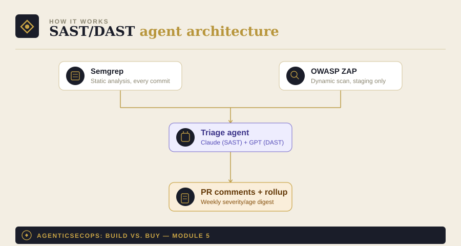

# Module 5: SAST/DAST + OWASP Top 10 Agent

Part of [AgenticSecOps: Build vs. Buy](../README.md). Read
[DISCLAIMER.md](../DISCLAIMER.md) before running anything here. Built
on the pattern in [Module 0](../00-foundations).

> **Code status: unvalidated.** The code in this module illustrates the
> architecture and approach — it has not been tested end-to-end against
> a live codebase. Adapt, test, and review it yourself before running
> it against anything that matters. Use is entirely at your own
> discretion and risk.

## 1. The problem

A vulnerability caught in a quarterly pentest already shipped to
production months earlier. Static analysis run once a quarter finds
the same thing static analysis run on every commit would have caught
before merge — the difference is entirely about when you find it, not
whether you eventually do.

**Consequence if missed:** an injection flaw or similar ships to
production and gets exploited. Liberal case — caught by a bug bounty
or internal review, a few thousand dollars to patch. Worst case — a
full data breach, $3.31M–$4.88M depending on data sensitivity.

## 2. Architecture



- **Semgrep**: static analysis on every commit — free, OSS, fast enough
  to run in CI without slowing the pipeline down
- **OWASP ZAP**: dynamic analysis against a running instance (staging,
  not prod) — catches what static analysis structurally can't, like
  runtime auth bypass
- **Triage agent**: dedupes findings, classifies against OWASP Top 10
  categories, and flags which are high-confidence enough to draft a fix
  for automatically
- **Output**: PR-level comments immediately, plus a weekly rollup of
  open findings by severity and age

## 3. Build walkthrough

### Prerequisites
- `semgrep` installed (`pip install semgrep`)
- OWASP ZAP running against a staging environment (never production —
  see boundaries below)
- An LLM API key — this module uses [Module 0](../00-foundations)'s
  provider-agnostic client

### The triage agent

```python
# sast_dast_agent.py
import json
import subprocess
from datetime import datetime, timezone

from model_client import ModelClient  # from Module 0
from pydantic import BaseModel


class TriagedFinding(BaseModel):
    finding_id: str
    owasp_category: str  # e.g. "A03:2021 - Injection"
    severity: str  # "critical" | "high" | "medium" | "low"
    auto_fixable: bool
    reasoning: str


TRIAGE_SYSTEM_PROMPT = """You are an application security triage
assistant. You'll be given raw findings from a Semgrep static-analysis
scan (and optionally OWASP ZAP dynamic-scan results).

For each finding:
1. Classify it against the relevant OWASP Top 10 (2021) category.
2. Assign severity based on actual exploitability in this codebase's
   context, not just the scanner's default rating.
3. Set auto_fixable = true only if the fix is mechanical and
   low-risk (e.g., adding a missing input-sanitization call using an
   established library function already used elsewhere in the
   codebase) — never for anything touching authentication or
   authorization logic.

Respond in JSON only: a list of {finding_id, owasp_category, severity,
auto_fixable, reasoning}.
"""


def run_semgrep(target_dir: str) -> list[dict]:
    result = subprocess.run(
        ["semgrep", "--config=auto", "--json", target_dir],
        capture_output=True, text=True, timeout=600,
    )
    parsed = json.loads(result.stdout)
    return parsed.get("results", [])


def triage(client: ModelClient, findings: list[dict]) -> list[TriagedFinding]:
    response = client._call_raw(
        system=TRIAGE_SYSTEM_PROMPT,
        user_content=json.dumps({"findings": findings}),
    )
    parsed = json.loads(response)
    return [TriagedFinding(**item) for item in parsed]


def main(target_dir: str):
    client = ModelClient(provider="anthropic", model="claude-sonnet-5")

    findings = run_semgrep(target_dir)
    print(f"{len(findings)} raw findings from Semgrep")

    if not findings:
        return

    triaged = triage(client, findings)
    auto_fixable = [t for t in triaged if t.auto_fixable]
    print(f"{len(auto_fixable)} findings eligible for a draft fix PR")
    print(f"{len(triaged) - len(auto_fixable)} findings need human review")

    with open("./triage_output.jsonl", "a") as f:
        for t in triaged:
            record = t.model_dump()
            record["scanned_at"] = datetime.now(timezone.utc).isoformat()
            f.write(json.dumps(record) + "\n")

    # PR-opening step deliberately left separate — see the CSPM module's
    # draft_pr.py for the same pattern applied to this module.


if __name__ == "__main__":
    main(target_dir=".")
```

## 4. Boundaries

| Zone | What the agent does |
|---|---|
| **Autonomous** | Run scans on every commit, dedupe, classify against OWASP categories, comment on PRs |
| **Human-gate** | Every draft fix PR requires review and merge — never auto-merge a security-fix PR, even a "high-confidence" one. OWASP ZAP runs against staging only, never production |
| **Vendor-territory** | If your false-positive rate stays above ~20% after tuning, that's usually a sign of missing AppSec expertise to configure the rulesets properly — a managed platform's pre-tuned rules may serve you better than a DIY setup nobody's maintaining |

## 5. Eval / KPI checklist

- **False-positive rate** — sample-audit weekly; retune rulesets if it
  climbs above ~20%
- **Mean-time-to-fix** by severity
- **Coverage** — % of the codebase actually exercised by both the
  static ruleset and the dynamic scan's crawl

## 6. Cost model

- **Build**: ~1 engineer, 4–6 weeks (~$15K–$25K in eng time)
- **Run**: Semgrep and ZAP are free/OSS; LLM inference scales with
  commit volume — this is one of the higher-volume modules in the
  series, budget accordingly rather than assuming CSPM-level costs
- **Vendor equivalent**: Snyk/Checkmarx-class platforms, roughly
  $3K–$15K/year for small teams, scaling to $30K–$80K/year mid-market
- **Ongoing**: ~0.2 FTE — rule tuning and false-positive triage is the
  real recurring cost here, not infrastructure

## 7. Model recommendation

Split by task: Claude-class models for the static-analysis half — this
is where multi-file, architectural vulnerability tracing (following a
value across several functions to confirm it's actually exploitable)
matters most. GPT-class models with strong computer-use capability for
the dynamic/browser-driven half, since DAST is fundamentally operating
a browser against a running app. See [Module 0](../00-foundations) for
the general framework.

## 8. Build vs. buy verdict

**Build**, once you have 2–3+ engineers and can tolerate the ~0.2 FTE
of ongoing rule-tuning — the underlying tools are free and mature, and
the agent's real value-add (triage, OWASP classification, draft fixes)
is a bounded task.

**Buy**, if you don't have anyone with AppSec background to tune
rulesets and your false-positive rate never comes down — a
pre-tuned commercial platform's rules, backed by a team that maintains
them full-time, will likely outperform a DIY setup nobody owns.
