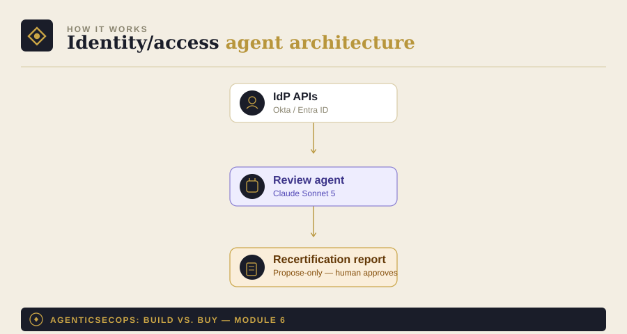

# Module 6: Identity & Access Review Agent

Part of [AgenticSecOps: Build vs. Buy](../README.md). Read
[DISCLAIMER.md](../DISCLAIMER.md) before running anything here. Built
on the pattern in [Module 0](../00-foundations).

> **Code status: unvalidated.** The code in this module illustrates the
> architecture and approach — it has not been tested end-to-end against
> a live IdP environment. Adapt, test, and review it yourself before
> running it against anything that matters. Use is entirely at your own
> discretion and risk.

## 1. The problem

Access accumulates and rarely gets cleaned up. Someone changes teams
and keeps their old permissions. A contractor's account outlives the
contract. An integration gets provisioned with far more scope than it
actually uses. Any one of these becomes the account an attacker
compromises, and it's rarely reviewed until something's already gone
wrong.

**Consequence if missed:** stale or excessive access enables lateral
movement or insider misuse. Liberal case — contained account misuse,
tens of thousands of dollars. Worst case — a privileged-account breach,
in the same $3.31M–$4.88M range as other breach categories, often
worse because privileged access means broader blast radius by design.

## 2. Architecture



- **IdP APIs**: Okta, Entra ID, or whichever identity provider holds
  your actual access truth
- **Review agent**: cross-references last-login data, role
  assignments, and org-chart context to flag what looks stale or
  excessive
- **Output**: a recertification report for human review — the agent
  never revokes access itself, only proposes

## 3. Build walkthrough

### Prerequisites
- Admin API access to your IdP (Okta or Entra ID)
- An LLM API key — this module uses [Module 0](../00-foundations)'s
  provider-agnostic client

### The review agent

```python
# access_review_agent.py
import json
from datetime import datetime, timezone

from model_client import ModelClient  # from Module 0
from pydantic import BaseModel


class AccessFlag(BaseModel):
    user_id: str
    flag_type: str  # "stale" | "excessive" | "orphaned" | "ok"
    reasoning: str
    recommended_action: str


REVIEW_SYSTEM_PROMPT = """You are an access-review assistant. You'll be
given a list of user accounts with their role assignments, last-login
date, and department/team context.

For each account, flag:
- "stale": no login in 90+ days
- "excessive": role scope doesn't match the stated job function (e.g.,
  a support role with database admin access)
- "orphaned": account exists with no clear owner or matching
  department record (e.g., a former employee's account, an
  unattributed service account)
- "ok": access matches role, recent activity, no concerns

Never recommend revocation directly — recommended_action should always
be phrased as a proposal for human review (e.g., "recommend
recertification with manager", "recommend downgrade to read-only,
confirm with IT"), never an instruction to execute.

Respond in JSON only: a list of {user_id, flag_type, reasoning,
recommended_action}.
"""


def review_accounts(client: ModelClient, accounts: list[dict]) -> list[AccessFlag]:
    response = client._call_raw(
        system=REVIEW_SYSTEM_PROMPT,
        user_content=json.dumps({"accounts": accounts}),
    )
    parsed = json.loads(response)
    return [AccessFlag(**item) for item in parsed]


def main():
    client = ModelClient(provider="anthropic", model="claude-sonnet-5")

    # Replace with a real pull from your IdP's admin API.
    accounts = [
        {"user_id": "u_1234", "role": "support-agent", "scope": ["db:admin"],
         "last_login": "2026-03-01", "department": "Customer Support"},
        {"user_id": "u_5678", "role": "engineer", "scope": ["repo:write"],
         "last_login": "2026-08-01", "department": "Engineering"},
    ]

    flags = review_accounts(client, accounts)
    needs_attention = [f for f in flags if f.flag_type != "ok"]
    print(f"{len(needs_attention)} accounts flagged for review out of {len(accounts)}")

    with open("./access_review_report.jsonl", "a") as f:
        for flag in flags:
            record = flag.model_dump()
            record["reviewed_at"] = datetime.now(timezone.utc).isoformat()
            f.write(json.dumps(record) + "\n")

    for f in needs_attention:
        print(f"  - {f.user_id} ({f.flag_type}): {f.recommended_action}")


if __name__ == "__main__":
    main()
```

## 4. Boundaries

| Zone | What the agent does |
|---|---|
| **Autonomous** | Flag stale, excessive, or orphaned access based on IdP data |
| **Human-gate** | Every revocation, downgrade, or access change — always, no exceptions. A wrongly revoked production service account is an outage, not just a security gap |
| **Vendor-territory** | If you're in a regulated environment requiring formal SOX-style access attestation, or you don't have an IdP admin who can validate "safe to revoke," a dedicated IGA product's workflow and audit trail will serve you better than a DIY report |

## 5. Eval / KPI checklist

- **% of accounts reviewed** on the quarterly cadence (see cost model —
  this maps to SOC 2's quarterly review expectation)
- **Time-to-recertify** once flagged
- **False-flag rate** — sample-audit monthly so the report doesn't
  become noise a manager rubber-stamps without reading

## 6. Cost model

- **Build**: ~1 engineer, 2–3 weeks (~$8K–$12K in eng time)
- **Run**: low — IdP API calls are infrequent, this doesn't need to run
  more than weekly or monthly
- **Vendor equivalent**: enterprise IGA platforms (SailPoint, Okta
  Identity Governance) often run $15K–$50K+/year — usually overkill for
  SMB, and most companies in this bracket fold access review into an
  MSSP retainer instead of buying a dedicated IGA product
- **Ongoing**: ~0.05–0.1 FTE plus IdP admin sign-off time

## 7. Model recommendation

Claude-class models specifically — this is fundamentally an
authorization-logic reasoning task (does this role's scope actually
match this person's function), which is the same underlying strength
that makes Claude a good fit for Module 3's CSPM config-tracing and
Module 10's SOC triage. See [Module 0](../00-foundations) for the
general framework.

## 8. Build vs. buy verdict

**Build**, viable at nearly any company stage — the IdP APIs are well
documented, the task is bounded, and the failure mode of a false flag
is a wasted review, not an incident, as long as the human-gate on
revocation holds.

**Buy**, if you're in a regulated environment needing formal
attestation workflows (SOX, certain financial/healthcare contexts) —
the audit trail and process rigor a dedicated IGA product provides is
worth more there than the cost savings of DIY.
