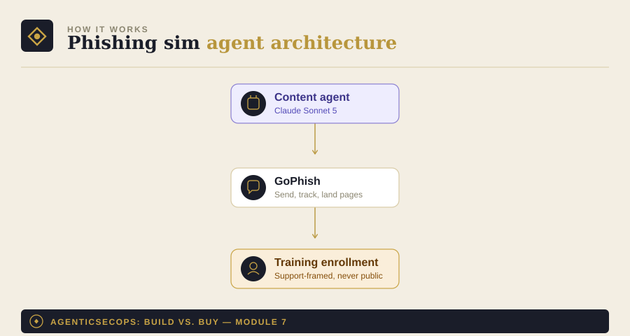

# Module 7: Phishing Simulation & Awareness Agent

Part of [AgenticSecOps: Build vs. Buy](../README.md). Read
[DISCLAIMER.md](../DISCLAIMER.md) before running anything here. Built
on the pattern in [Module 0](../00-foundations).

> **Code status: unvalidated.** The code in this module illustrates the
> architecture and approach — it has not been tested end-to-end against
> a live environment. Adapt, test, and review it yourself before
> running it against anything that matters. Use is entirely at your own
> discretion and risk.

> **This module has an HR/legal dimension the others don't.** Running
> simulated phishing against employees has policy and consent
> implications separate from the security engineering. Involve HR and
> get explicit sign-off on the program itself before launching anything
> here — see boundaries below.

## 1. The problem

One untrained employee clicking one convincing email is often the
entire initial-access step in a breach. Attackers rotate lure themes
faster than annual training refreshes them, so awareness that isn't
tested regularly decays quietly until it's tested for real.

**Consequence if missed:** an employee falls for a real phishing
attempt. Liberal case — credential reset, contained, low thousands of
dollars. Worst case — business email compromise fraud (tens of
thousands to $1M+ per incident) or the start of a full ransomware
chain, averaging around $2M in ransom payment alone.

## 2. Architecture



- **Content agent**: generates varied, realistic lure templates (never
  reused verbatim — repetition is what makes simulations easy to spot
  and real attacks easy to miss)
- **GoPhish**: [open-source phishing simulation
  framework](https://github.com/gophish/gophish) — handles sending,
  tracking, and landing pages; the agent doesn't reinvent this
- **Tracking**: click-through and report rates per campaign
- **Training enrollment**: repeat clickers get enrolled in targeted
  training — never punitive, never public

## 3. Build walkthrough

### Prerequisites
- GoPhish installed and configured (see their docs)
- **HR sign-off on the program** — this comes before any technical
  setup, not after
- An LLM API key — this module uses [Module 0](../00-foundations)'s
  provider-agnostic client

### The content + tracking agent

```python
# phishing_sim_agent.py
import json
from datetime import datetime, timezone

from model_client import ModelClient  # from Module 0
from pydantic import BaseModel


class LureTemplate(BaseModel):
    subject: str
    body: str
    theme: str  # e.g. "invoice", "mfa-fatigue", "hr-benefits"
    difficulty: str  # "easy" | "moderate" | "hard"


GENERATE_SYSTEM_PROMPT = """You are generating a simulated phishing
email for an authorized internal security-awareness campaign. This is
for training purposes only, run with organizational approval.

Generate a realistic but clearly template-varied lure using the theme
provided. Rotate structure and wording — never reuse a previous
template verbatim, since repeated exact wording defeats the purpose of
periodic testing.

Do not impersonate a specific named real individual. Use generic role
titles (e.g., "IT Support", "HR Benefits Team") rather than real
employee names.

Respond in JSON only: {subject, body, theme, difficulty}.
"""


def generate_lure(client: ModelClient, theme: str, difficulty: str) -> LureTemplate:
    response = client._call_raw(
        system=GENERATE_SYSTEM_PROMPT,
        user_content=json.dumps({"theme": theme, "difficulty": difficulty}),
    )
    parsed = json.loads(response)
    return LureTemplate(**parsed)


def flag_repeat_clickers(click_log_path: str, threshold: int = 2) -> list[str]:
    """Returns user IDs who've clicked more than `threshold` simulated
    campaigns — these get enrolled in targeted training, never
    disciplinary action, and never a public list."""
    from collections import Counter
    clicks = Counter()
    with open(click_log_path) as f:
        for line in f:
            if not line.strip():
                continue
            record = json.loads(line)
            clicks[record["user_id"]] += 1
    return [user for user, count in clicks.items() if count > threshold]


def main():
    client = ModelClient(provider="anthropic", model="claude-sonnet-5")

    lure = generate_lure(client, theme="invoice", difficulty="moderate")
    print(f"Generated lure: {lure.subject}")

    # Push `lure` into GoPhish via its API to launch the campaign —
    # left as an exercise per your GoPhish instance configuration.

    repeat_clickers = flag_repeat_clickers("./click_log.jsonl")
    if repeat_clickers:
        print(f"{len(repeat_clickers)} users flagged for targeted training")
        # Enroll in training here — never a punitive action, never a
        # public list. Route through HR's existing training system.


if __name__ == "__main__":
    main()
```

## 4. Boundaries

| Zone | What the agent does |
|---|---|
| **Autonomous** | Generate lure content, launch approved campaigns, track click/report rates |
| **Human-gate** | HR/legal sign-off on the program itself, before anything launches — this isn't a one-time approval, review it periodically as the program continues. Training enrollment for repeat clickers is automatic, but always framed as support, never discipline |
| **Vendor-territory** | Once you're past ~100 employees, buying a training *content library* (not just the sending mechanics) usually becomes worthwhile — maintaining a genuinely fresh, varied lure library at scale is more content-production work than most security teams want to own |

## 5. Eval / KPI checklist

- **Click-through rate trend** over time — should decrease with
  effective training, not just stay flat
- **Report rate** — are people reporting suspicious emails, not just
  avoiding clicks (reporting is the behavior you actually want)
- **Training completion rate** for enrolled users

## 6. Cost model

- **Build**: ~1 engineer + HR/legal review time, 1–2 weeks of eng time
  (~$5K–$8K)
- **Run**: GoPhish is free/OSS; LLM inference is minimal — content
  generation is infrequent, not continuous
- **Vendor equivalent**: KnowBe4/Proofpoint-style platforms, roughly
  $1.5K–$4K/year for small teams
- **Ongoing**: minimal engineering (~0.05 FTE) — the real ongoing cost
  is HR's ownership of the training program itself

## 7. Model recommendation

Any current frontier model works well here — this is a low-stakes
generation task, not a reasoning-heavy one, so model choice isn't a
meaningful differentiator the way it is in modules like CSPM or
identity review. Default to whichever provider you're already using
elsewhere. See [Module 0](../00-foundations) for the swap pattern if
you want to compare content quality across providers anyway.

## 8. Build vs. buy verdict

**Build**, cheap at any company stage — the technical lift is small and
GoPhish already does the hard part. The real constraint isn't
engineering, it's whether you have HR bandwidth to own the program
responsibly.

**Buy** the training content library once you're past ~100 employees
and the lure-variety problem becomes a real content-production burden
— at that scale, a vendor's maintained template library is worth more
than the module's build-cost savings.
