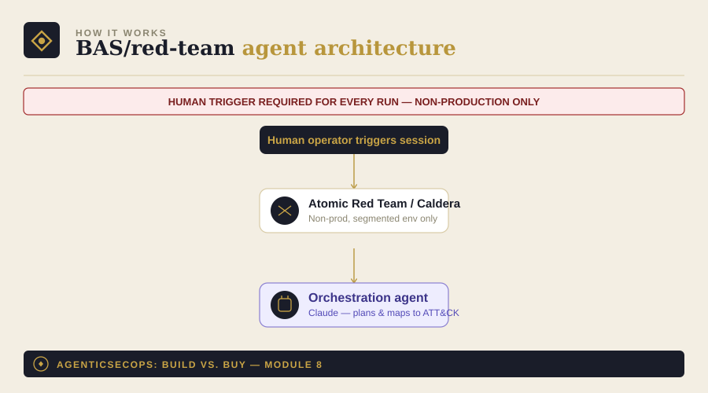

# Module 8: Breach & Attack Simulation (BAS) / Red-Team Agent

Part of [AgenticSecOps: Build vs. Buy](../README.md). Read
[DISCLAIMER.md](../DISCLAIMER.md) before reading further. Built on the
pattern in [Module 0](../00-foundations).

> **This module is architecture and pseudocode only — deliberately, not
> an oversight.** Unlike modules 1–7 and 10, there is no runnable
> script here. Detailed, working code for adversary emulation carries
> real misuse risk regardless of intent, and this module's own
> build-vs-buy verdict leans toward caution. See
> [DISCLAIMER.md](../DISCLAIMER.md) for the full authorization
> requirement — it applies with extra force here.

> **Authorization required, restated explicitly for this module:**
> anything described below must only ever run in a segregated,
> non-production test environment you own or are explicitly authorized
> to test. Never against production, ever, regardless of how confident
> the scoping feels.

## 1. The problem

Detection tooling that's never been tested against real attack
techniques is a guess, not a control. You don't find out it has gaps
until a real incident walks through one — and by then, the cost isn't
just the breach, it's the extra dwell time an undetected attacker gets
because nothing caught them earlier.

**Consequence if missed:** a detection gap never gets found until a
real attack exploits it, and dwells longer as a result. Liberal case —
caught late but contained, moderate cost. Worst case — the dwell-time
tax itself: breaches identified after 200 days average ~$5.49M versus
~$3.61M when caught faster, a difference of roughly $1.9M attributable
mostly to how long the attacker went unnoticed.

## 2. Architecture



- **Atomic Red Team / Caldera**: open-source adversary emulation
  frameworks that execute known MITRE ATT&CK techniques in a controlled
  way — the agent orchestrates these, it does not reimplement
  exploitation logic itself
- **Orchestration agent**: plans which techniques to run in a session,
  interprets results, and maps outcomes to ATT&CK coverage
- **Hard boundary**: everything above runs inside a network-segmented,
  non-production environment only, with a human trigger required for
  every run — never scheduled, never autonomous end-to-end
- **Output**: a coverage report — which techniques were detected,
  which weren't, mapped to MITRE ATT&CK

## 3. Build approach (pseudocode, not runnable)

This is intentionally written as pseudocode-level description of the
orchestration logic, not working code:

```
FUNCTION run_bas_session(target_environment, technique_set):
    ASSERT target_environment.is_non_production == True
    ASSERT target_environment.is_network_segmented == True
    REQUIRE human_operator.explicit_trigger()  # never auto-scheduled

    session = new_session(kill_switch=True)

    FOR technique IN technique_set:
        result = adversary_framework.execute(
            technique_id=technique.mitre_attack_id,
            target=target_environment,
            session=session
        )
        detection_status = check_detection_stack(technique, result)
        session.log(technique, result, detection_status)

        IF human_operator.requests_stop():
            session.halt()
            BREAK

    coverage_report = map_to_attack_matrix(session.results)
    RETURN coverage_report  # detected vs. missed, by technique

FUNCTION check_detection_stack(technique, result):
    # Queries your SIEM/EDR to confirm whether the technique execution
    # actually generated an alert — this is the signal that matters,
    # not whether the technique itself "succeeded"
    ...
```

The orchestration agent's actual job in this pattern is steps like
`map_to_attack_matrix` and session planning — deciding which technique
sequence makes sense to test next based on prior results — not the
underlying exploitation, which the established OSS frameworks already
handle safely within their own scoping.

## 4. Boundaries

| Zone | What's allowed |
|---|---|
| **Autonomous** | Nothing runs without a human trigger, ever — the agent's "autonomy" is limited to planning technique sequences and interpreting results between human-initiated runs |
| **Human-gate** | Every single session start, every session's scope, and the decision to proceed after any unexpected result |
| **Hard exclusion** | Production, always. No exceptions, no "just this once," no autonomous scheduling |

## 5. Eval / KPI checklist

- **MITRE ATT&CK technique coverage %** — how much of your relevant
  threat model is actually tested, not just "we ran some techniques"
- **Time between sessions** — detection coverage decays as your stack
  changes; infrequent testing is close to no testing
- **Gaps closed per cycle** — are findings from the last session
  actually getting remediated before the next one

## 6. Cost model

- **Build**: 1–2 security engineers with real offensive-security
  literacy (not just general eng background), 4–8 weeks (~$25K–$40K in
  eng time) — this is meaningfully more specialized than most other
  modules in the series
- **Vendor equivalent**: SafeBreach/Cymulate/AttackIQ-class platforms,
  roughly $30K–$80K/year
- **Ongoing**: ~0.2–0.3 FTE, and it needs to be someone with the
  offensive-security background to interpret results correctly, not
  just run the sessions

## 7. Model recommendation

Claude-class models for the planning/reasoning layer — this is a
long-horizon, multi-step task (deciding what to test next based on
what happened last time) where sustained reasoning across a session
matters more than raw speed. The exploitation itself is handled by the
established OSS frameworks, not the LLM. See
[Module 0](../00-foundations) for the general framework.

## 8. Build vs. buy verdict

**Build**, only if you're mid-size or larger with a detection stack
mature enough to be worth validating, a genuinely segregated non-prod
environment, and — critically — staff with real offensive-security
background to own this safely. This is not a good first security-agent
project for a small team.

**Buy**, for most companies below that bar. This module has a higher
skill floor and a less forgiving failure mode than almost anything else
in this series — the vendor platforms have already solved the
safe-scoping problem you'd otherwise be recreating, often imperfectly,
from scratch.
