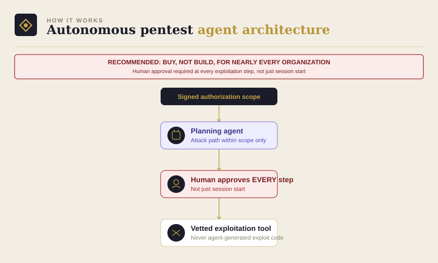

# Module 9: Autonomous Pentest Agent

Part of [AgenticSecOps: Build vs. Buy](../README.md). Read
[DISCLAIMER.md](../DISCLAIMER.md) before reading further. Built on the
pattern in [Module 0](../00-foundations).

> **This module is architecture and pseudocode only — deliberately, not
> an oversight, and more conservatively scoped than any other module in
> this series.** There is no runnable script here, and the build
> approach below is intentionally high-level. This is the one module
> where the series' own conclusion is: most organizations should not
> build this themselves. See the verdict in section 8 before you read
> anything else.

> **Authorization required, restated explicitly for this module, with
> the highest stakes in the series:** autonomous exploitation against
> any system you don't own or lack explicit written authorization to
> test is both unethical and, under laws like the U.S. Computer Fraud
> and Abuse Act, illegal regardless of intent. This module's failure
> mode isn't a missed finding — it's the agent itself causing an
> outage, data corruption, or unauthorized access.

## 1. The problem

Vulnerabilities found in an annual pentest have often been sitting
exploitable for months by the time anyone checks. Continuous automated
testing closes that gap — but exploitation, unlike scanning, is not a
low-blast-radius activity. Getting it wrong doesn't mean a missed
finding; it means the "test" itself becomes the incident.

**Consequence if missed:** a real vulnerability sits unpatched and
eventually gets exploited by an actual attacker. Standard breach cost
range applies. **Consequence if the tooling itself fails**: an
autonomous exploitation agent causes an outage or data corruption on
its own — a different and arguably worse failure mode than the thing
it was built to prevent.

## 2. Architecture



- **Scoping layer**: a strict, human-defined authorization boundary —
  target list, allowed technique list, explicit exclusions — checked
  before anything else runs
- **Planning agent**: reasons about attack paths within the authorized
  scope only
- **Execution**: delegated to established, purpose-built exploitation
  tooling rather than ad hoc agent-generated exploit code — the
  distinction between "orchestrates a vetted tool" and "writes and runs
  its own exploit" matters enormously for safety
- **Human checkpoint**: required before any exploitation step proceeds,
  not just at session start

## 3. Build approach (pseudocode, not runnable)

```
FUNCTION run_pentest_session(authorized_scope):
    ASSERT authorized_scope.has_signed_authorization == True
    ASSERT authorized_scope.target_list IS NOT EMPTY
    REQUIRE human_operator.explicit_trigger()

    plan = planning_agent.generate_attack_path(
        targets=authorized_scope.target_list,
        allowed_techniques=authorized_scope.allowed_techniques
    )

    FOR step IN plan:
        ASSERT step.target IN authorized_scope.target_list  # re-check every step
        REQUIRE human_operator.approve(step)  # not just session-level approval

        result = vetted_exploitation_tool.execute(step)  # not agent-generated exploit code
        log(step, result)

        IF result.caused_unexpected_impact:
            session.halt_immediately()
            alert_human_operator()
            BREAK

    RETURN session.findings_report()
```

The two design choices doing the real safety work here: **re-checking
authorization scope at every step, not just once**, and **delegating
actual exploitation to established tooling rather than letting the
agent generate and run its own exploit code**. Removing either of
those is where a DIY version of this module gets genuinely dangerous.

## 4. Boundaries

| Zone | What's allowed |
|---|---|
| **Autonomous** | Attack-path planning within pre-authorized scope only |
| **Human-gate** | Every exploitation step, not just session start — this module needs a tighter approval loop than any other in the series |
| **Hard exclusion** | Anything outside signed, written authorization. No exceptions, no implied scope, no "probably fine" |

## 5. Eval / KPI checklist

- **Scope-violation rate** — this should be exactly zero; even one
  incident here is a program failure, not a metric to optimize
- **Time-to-finding** for genuinely new, previously-unknown
  vulnerabilities
- **Reproducibility** — every finding should include a reproducible
  proof-of-concept, not just an assertion

## 6. Cost model

- **Build**: honestly, don't — realistically 2–3 senior offensive-
  security engineers, 3–6+ months, $150K–$300K+ to reach something
  safe and defensible, and you'd still be behind well-funded specialist
  vendors who've invested years in the safety engineering specifically
- **Vendor equivalent**: typical engagement pricing runs roughly
  $5,000–$35,000, averaging around $18,300; continuous/platform-based
  models exist at subscription-plus-credits pricing
- **If you buy**: budget ~0.1 FTE internally just to manage vendor
  scope, authorization paperwork, and remediation triage

## 7. Model recommendation

Not a meaningful comparison to make here — the safety properties of
the surrounding system (scoping enforcement, human-checkpoint design,
delegation to vetted exploitation tooling) matter far more than which
LLM powers the planning layer. See [Module 0](../00-foundations) for
the general model-selection framework, which applies more usefully to
every other module in this series than to this one.

## 8. Build vs. buy verdict

**Buy, at every company stage below "already operates a mature,
dedicated internal red team."** This is the one module in the entire
series where that's the default answer, not a caveat. The vendor
market has already solved the safe-exploitation problem — with years
of dedicated safety engineering — that a DIY build would be recreating
from scratch, with real potential for causing exactly the kind of harm
this module exists to prevent.

If you're evaluating whether your organization is the exception:
you're probably not, and organizations that genuinely are usually
already know it and aren't reading a build-vs-buy tutorial to find
out.
