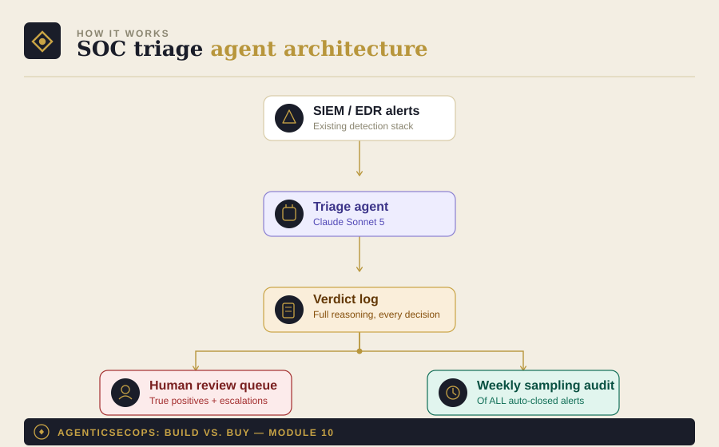

# Module 10: SOC Alert-Triage Agent

Part of [AgenticSecOps: Build vs. Buy](../README.md). Read
[DISCLAIMER.md](../DISCLAIMER.md) before running anything here. Built
on the pattern in [Module 0](../00-foundations).

> **Code status: unvalidated.** The code in this module illustrates the
> architecture and approach — it has not been tested end-to-end against
> a live SIEM/EDR environment. Adapt, test, and review it yourself
> before running it against anything that matters. Use is entirely at
> your own discretion and risk.

## 1. The problem

Alert fatigue is the actual failure mode behind most missed breaches —
not a lack of detection, but a human unable to triage hundreds of
alerts a day, so the one real signal gets lost in the noise along with
everything else. The fix isn't more alerts, it's faster, more reliable
triage of the ones you already have.

**Consequence if missed:** the agent (or a human under the same
volume pressure) misclassifies a true positive as noise, and it goes
undetected. Liberal case — caught by a secondary control, contained,
$50K–$100K. Worst case — a full breach at the dwell-time-extended end
of the range, since a missed true positive directly extends how long
an attacker goes unnoticed: ~$5.49M average when detection takes over
200 days, versus ~$3.61M when caught faster.

## 2. Architecture



- **SIEM/EDR alerts**: wherever your alerts already land — this module
  doesn't replace your detection stack, it triages what it produces
- **Triage agent**: investigates each alert — pulls asset context,
  correlates against threat intel, drafts a verdict with reasoning
- **Verdict log**: every decision logged with full reasoning, for audit
  trail and for the sampling-audit step below
- **Sampling audit**: a human reviews a percentage of auto-closed
  alerts every week — this is not optional, see boundaries

## 3. Build walkthrough

### Prerequisites
- Read access to your SIEM/EDR's alert stream (API or export)
- A threat-intel source to correlate against (even a basic IOC feed
  helps)
- An LLM API key — this module uses [Module 0](../00-foundations)'s
  provider-agnostic client

### The triage agent

```python
# triage_agent.py
import json
from datetime import datetime, timezone

from model_client import ModelClient  # from Module 0
from pydantic import BaseModel


class TriageVerdict(BaseModel):
    alert_id: str
    verdict: str  # "true_positive" | "false_positive" | "needs_escalation"
    confidence: str  # "high" | "medium" | "low"
    reasoning: str


TRIAGE_SYSTEM_PROMPT = """You are a SOC alert-triage assistant. You'll
be given a raw alert (source, signature, affected asset) plus context:
asset criticality, recent related alerts, and any threat-intel matches
for observed indicators.

Draft a verdict:
- "true_positive": genuine malicious activity, needs response
- "false_positive": benign activity that matched a detection rule
- "needs_escalation": you don't have enough signal to decide
  confidently — use this rather than guessing on ambiguous cases

Set confidence honestly. A "low confidence false_positive" should
never be auto-closed — that combination should always route to
needs_escalation instead, since a confident wrong answer is worse than
an honest "I'm not sure."

Respond in JSON only: {alert_id, verdict, confidence, reasoning}.
"""


def triage_alert(client: ModelClient, alert: dict, context: dict) -> TriageVerdict:
    response = client._call_raw(
        system=TRIAGE_SYSTEM_PROMPT,
        user_content=json.dumps({"alert": alert, "context": context}),
    )
    parsed = json.loads(response)
    return TriageVerdict(**parsed)


def should_auto_close(verdict: TriageVerdict) -> bool:
    """Only high-confidence false positives are eligible for auto-close
    — and even then, see the sampling-audit requirement in boundaries.
    Everything else routes to a human queue."""
    return verdict.verdict == "false_positive" and verdict.confidence == "high"


def main():
    client = ModelClient(provider="anthropic", model="claude-sonnet-5")

    # Replace with a real pull from your SIEM/EDR's alert API.
    alert = {"alert_id": "a_9001", "source": "EDR", "signature": "suspicious_process_spawn"}
    context = {"asset_criticality": "high", "threat_intel_matches": []}

    verdict = triage_alert(client, alert, context)
    auto_close = should_auto_close(verdict)

    print(f"{verdict.alert_id}: {verdict.verdict} ({verdict.confidence}) — auto_close={auto_close}")

    with open("./verdict_log.jsonl", "a") as f:
        record = verdict.model_dump()
        record["auto_closed"] = auto_close
        record["triaged_at"] = datetime.now(timezone.utc).isoformat()
        f.write(json.dumps(record) + "\n")


def weekly_sampling_audit(verdict_log_path: str, sample_rate: float = 0.2) -> list[dict]:
    """Returns a random sample of auto-closed verdicts for human review.
    Run this every week without exception — it's how you catch verdict
    drift before it becomes a missed breach, not after."""
    import random
    auto_closed = []
    with open(verdict_log_path) as f:
        for line in f:
            if not line.strip():
                continue
            record = json.loads(line)
            if record.get("auto_closed"):
                auto_closed.append(record)
    sample_size = max(1, int(len(auto_closed) * sample_rate))
    return random.sample(auto_closed, min(sample_size, len(auto_closed)))


if __name__ == "__main__":
    main()
```

## 4. Boundaries

| Zone | What the agent does |
|---|---|
| **Autonomous** | Investigate, correlate with threat intel, draft a verdict with reasoning |
| **Human-gate** | Closing any alert — even auto-closed false positives require a weekly sampling audit, not a one-time approval. Never fully autonomous closing with zero review, regardless of how high the confidence score is |
| **Vendor-territory** | Once alert volume outpaces your team's capacity to review sampled verdicts weekly, that's the signal you've outgrown DIY and need the 24/7 human coverage a dedicated MDR provider staffs |

## 5. Eval / KPI checklist

- **False-positive / false-negative rate**, measured via the sampling
  audit — this is the metric to watch closest of any module in the
  series, since a miss here directly extends breach dwell time
- **Time-to-verdict**
- **Sampling-audit coverage** — did the weekly audit actually happen,
  every week, without exception

## 6. Cost model

- **Build**: 1–2 engineers, 6–10 weeks (~$40K–$70K in eng time) —
  ongoing tuning is the real cost driver here, not the initial build
- **Run**: this is one of the highest-volume modules in the series —
  budget for continuous inference cost scaling with alert volume, not
  a periodic-scan cost profile
- **Vendor equivalent**: MDR pricing runs roughly $7–$25/endpoint/month;
  for 500 endpoints that's $90K–$300K/year. Compare against an in-house
  24×7 SOC needing 5–6 analysts plus a manager (~$700K–$900K/year in
  salary) and $1M–$2M in year-one infrastructure — the vendor number
  looks a lot better next to that second figure than it does in
  isolation
- **Ongoing**: substantial — this module needs continuous tuning
  attention, not "set it up once"

## 7. Model recommendation

Claude-class models — this is fundamentally an investigation task
requiring the same authorization/data-flow reasoning strength that
makes Claude a strong fit for Module 3's CSPM tracing and Module 6's
access review, applied here to alert context instead. See
[Module 0](../00-foundations) for the general framework.

## 8. Build vs. buy verdict

**Buy**, for early-stage and mid-size companies — the math here doesn't
favor DIY the way it does for most other modules, because someone
still has to be the human sampling-audit reviewer at 3am regardless of
how good the agent is. That's a staffing and coverage problem, not
just an engineering one, and it's exactly what MDR pricing is buying
you.

**Build**, only as an augmentation layer for companies that already
have an existing SOC and analyst team — there, this module can reduce
analyst load on the high-volume, low-signal alerts, freeing human
attention for the cases that actually need it, without needing to
replace 24/7 coverage you already staff.
